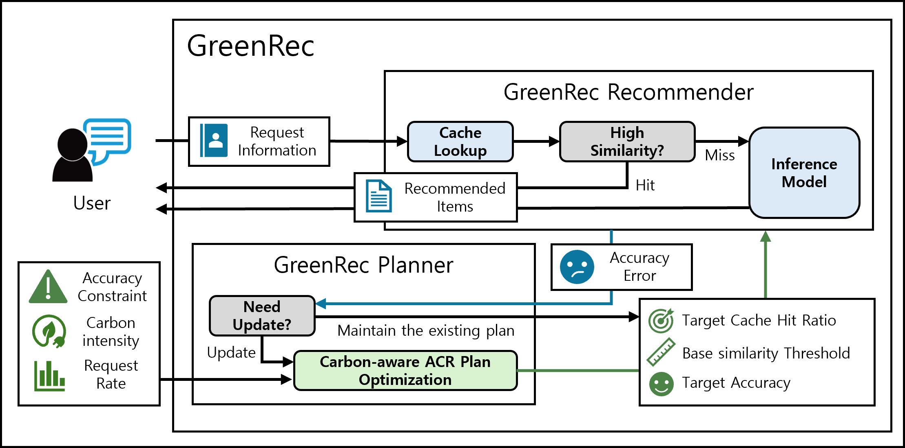

# GreenRec: Carbon-aware Recommendation System with Approximate Computation Reuse




## Contents
- [1. Code Structure](#1-code-structure)
- [2. About simulation](#2-about-simulation)
- [3. Experimenatal Setup](#3-experimenatal-setup)
- [4. Getting Started Instructions](#4-getting-started-instructions)
- [5. Run Simulator](#5-run-simulator)
- [6. Results](#6-results)
- [7. Appendix](#7-appendix)

## 1. Code Structure
| **Folders** | **Description**                  |
|---------------|------------------------------------|
| bashrc     | Contains simulation running bash script code (simulator.sh) |
| data       | Preprocessed carbon intensity and recommendation workload trace file |
| result        | Simulation logs and results are stored in this folder |
| saved            | DNN recommendation models should be placed in this folder |
| src            | All GreenRec fucntion and simulator python codes |

## 2. About simulation
This repository provides the code and data to compare the performance of GreenRec with BASE. By simply running a bash script, you can simulate various environments (such as carbon intensity, recommendation workload traces, and accuracy constraints). Most of the implementation follows what is introduced in the paper. However, for the energy measurement module, profiled values are used for compatibility. If you want to perform actual energy measurements, you can use the functions in the `src/ENERGY_function.py` file.

## 3. Experimenatal Setup
The experimental environment is configured as follows:

| **Component** | **Specification**                  |
|---------------|------------------------------------|
| Processor     | Intel Xeon Gold 5218 2.3 GHz, 64-Core |
| Chipset       | Intel C621                         |
| Memory        | DDR4 2666 MHz, 128 GB (32 GB x4)  |
| GPU            | NVIDIA RTX 2090 |
| Driver            | NIVIDA Driver 545.23.08 |
| CUDA            | cuda_12.3.r12.3 |
| OS            | Ubuntu 20.04 Server (kernel v5.16.1)|

## 4. Getting Started Instructions
For compatability, there is a Dockerfile that can imitate our evalutation setup.

First, build Docker image.
```bash
docker build -t dockerID/greenrec:tag
```

Second, run Docker file and place GreenRec repository folder inside the docker container.
```bash
docker run -dit --privileged --name GreenRec --gpus all dockerID/greenrec:tag
docker cp GreenRec:path GreenRec_repository_folder
```

Third, install all requirements to run GreenRec.
```bash
pip install -r requirements.txt
```

## 5. Run Simulator
Running the `bashrc/simulator.sh` script starts the simulation.
Cation: you should execute `simulater.sh` inside the `bashrc` folder since our repository use relative path in simulator code.
```bash
bash ./simulator.sh arguments
```

The `simulator.sh` script requires five arguments, each of which has the following meaning:
| **Argument** | **Description**                  |
|---------------|------------------------------------|
| 1. Simulation Mode     | 0: BASE 1: GreenRec |
| 2. Recommendation Workload       | 0: MovieLens 1: Twitch |
| 3. Carbon Intensity    | 0: NESO Increase 1: NESO Decrease 2: NESO Stable |
| 4. Accuracy Constraint    | 0: Const. High 1: Const. Mid 2: Const. Low |
| 5. Refine parameter    | 0 ~ 320 |

For example, if you want to simulate MovieLens workload with GreenRec on NESO Decrease, Mid Constraint and refine parameter 40, you should complete your running code like this.
```bash
bash ./simulator.sh 1 0 1 1 40
```

By this way, simulator code starts running and writes logs and results in `result` folder

## 6. Results
If all simulations terminates, in log file, you can see final result.

```bash
================== simulation result ====================
TOTAL CARBON: 44.195512771536244
OPTIMIZE CARBON: 4.267921061571182
SEARCH CARBON: 0.9419837009668395
EXTRACT CARBON: 2.168440940745376
INSERT CARBON: 0.3015082769288639
SAVE CARBON: 0.0002531014664074795
INFERENCE CARBON: 36.51540568985581


CACHE HIT RATE: 0.44843322178278067
HIT10 : 0.5372680255552176
Accuracy Constraint Guarantee: 1.0129922270104363
```
According to the result, GreenRec can operate with low carbon footprint while maintaining considerable accuracy.


## 7. Appendix
Raw Datasets and Vanila DNN recommendation model code that are used in this simulation is assesible in these links
| **asset** | **Link**                  |
|---------------|------------------------------------|
| MovieLens-1M     | https://grouplens.org/datasets/movielens/ |
| Twitch-100K  | https://github.com/JRappaz/liverec?tab=readme-ov-file |
| Bert4Rec  | https://github.com/FeiSun/BERT4Rec |
